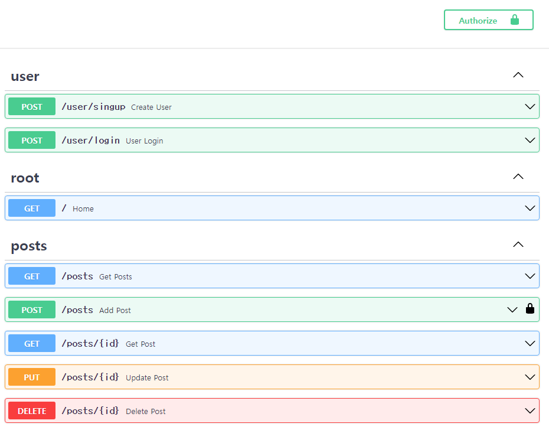

## Jwt 토큰을 사용한 인증



## TODO
- [] refresh token 발급
- [] hash password 
- [] database connection
- [] test 
- [] frontend user login 

## Usage

1. poetry 가상환경 실행
```bash
$ cd fastapi-jwt
$ poetry shell
```

2. secret 생성 후 .env 파일에 추가

```python
import binascii
import os

# Generate a random secret key
secret = binascii.hexlify(os.urandom(32)).decode()
```

3. 서버 실행
```bash
$ python main.py
```