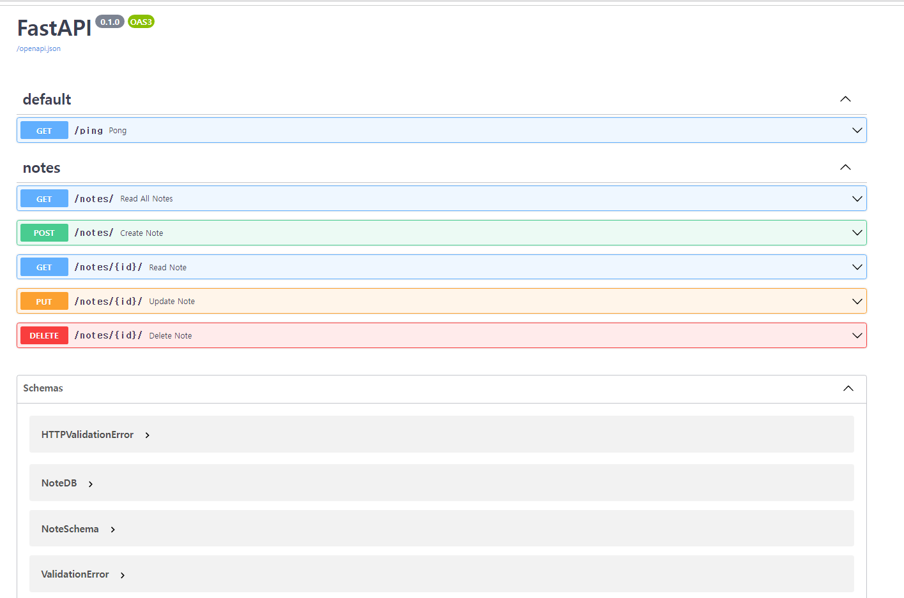

@@ -1,30 +0,0 @@
# Fastapi CRUD with Async Database 



## TODO
- [ ] [Fastapi 문서](https://fastapi.tiangolo.com/tutorial/) 읽어보기
- [ ] [async background tasks](https://fastapi.tiangolo.com/tutorial/background-tasks/) 기능
- [ ] [database migrations](https://fastapi.tiangolo.com/tutorial/sql-databases/#migrations) 기능
- [ ] [auth 기능](https://fastapi.tiangolo.com/tutorial/security/simple-oauth2/)
- [ ] 환경변수 저장을 위한 별도 파일 분리
- [ ] [uvicorn with Gunicorn](https://www.uvicorn.org/#running-with-gunicorn)
- [ ] [배포](https://fastapi.tiangolo.com/deployment/)
- [ ] uvicorn-gunicorn-fastapi 도커 이미지 공부

### Usage

1. 저장소 clone or fork
2. 도커 이미지 빌드 및 컨테이너 실행
```bash
$ docker-compose up -d --build
```
3. 테스트 코드 실행
```bash
$ cd src
$ docker-compose exec web pytest .
```

---
- psql shell 접속
```bash
$ docker-compose exec db psql --username=fastapi --dbname=fastapi

# 모든 데이터베이스 출력
$ \l

# fastapi user 이름으로 데이터베이스 연결
$ \c fastapi

# 테이블 확인
$ \dt
```