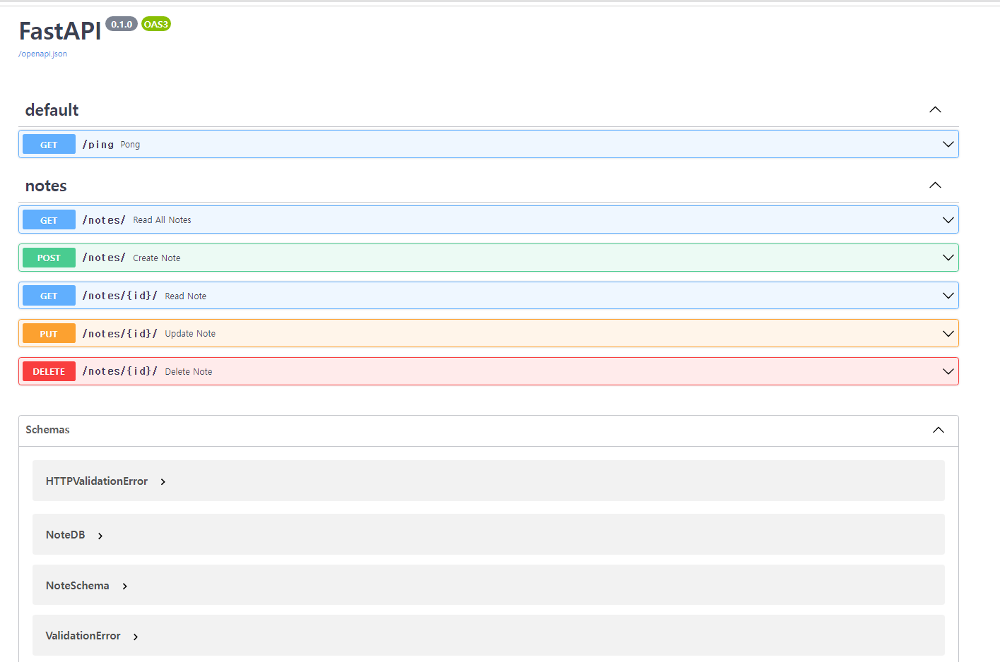

# Fastapi CRUD with Synchronous Database 



### Usage

1. 저장소 clone or fork
2. 도커 이미지 빌드 및 컨테이너 실행
```bash
$ docker-compose up -d --build
```
3. 테스트 코드 실행
```bash
$ cd src
$ docker-compose exec web pytest .
```